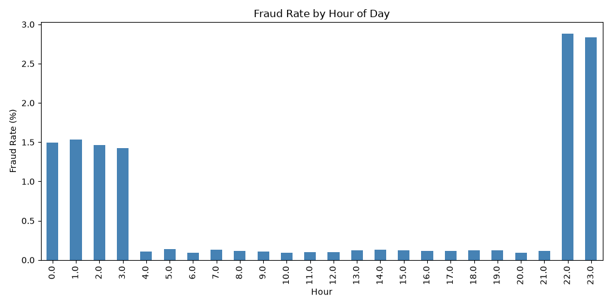
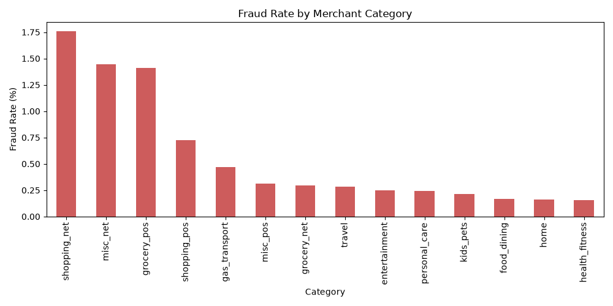
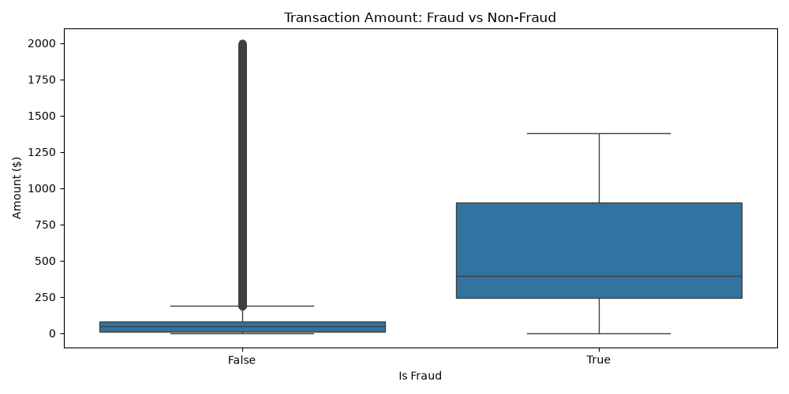
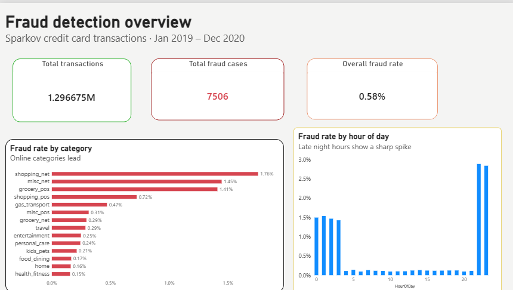
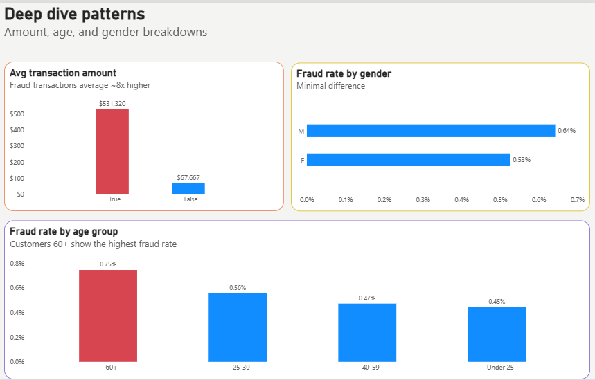
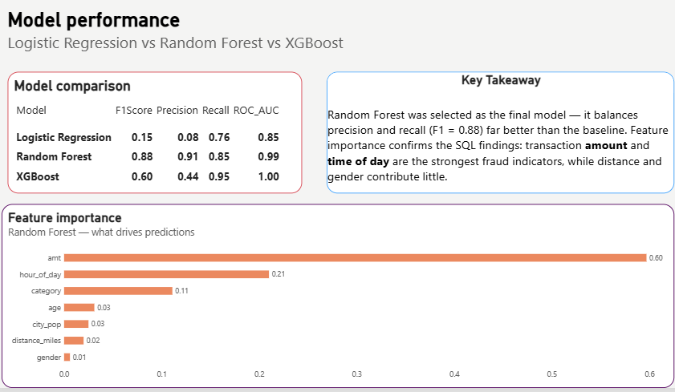

# Fraud Risk Pipeline
### End-to-End Fraud Detection Using SQL Analytics, Machine Learning, and Business Intelligence

[](https://app.powerbi.com/links/AvMnaDKVLh?ctid=bc5b2879-3fac-469a-b8c4-994705bc09d7&pbi_source=linkShare)


---

## Overview

Financial institutions and payment platforms process millions of transactions every day. A small but costly fraction are fraudulent, and manual review at that scale is impossible. This project simulates how a data team would approach that problem end-to-end: starting from raw transaction records, exploring the data through SQL, engineering features, training and comparing multiple classification models, and packaging the results into a business-facing dashboard.

The goal wasn't just to train a model with high accuracy — it was to build a defensible, well-reasoned pipeline where every decision (which features matter, which model to deploy, which signals turned out to be irrelevant) is backed by evidence from the data itself.

**→ [Explore the live interactive dashboard](https://app.powerbi.com/links/AvMnaDKVLh?ctid=bc5b2879-3fac-469a-b8c4-994705bc09d7&pbi_source=linkShare)**

---

## Table of Contents

1. [Dataset](#dataset)
2. [Tech Stack](#tech-stack)
3. [Project Workflow](#project-workflow)
4. [SQL Exploratory Analysis](#1-sql-exploratory-analysis)
5. [Python EDA](#2-python-eda)
6. [Feature Engineering](#3-feature-engineering)
7. [Model Building & Evaluation](#4-model-building--evaluation)
8. [Business Intelligence Dashboard](#5-business-intelligence-dashboard)
9. [Key Takeaways](#key-takeaways)
10. [Future Improvements](#future-improvements)
11. [Repository Structure](#repository-structure)

---

## Dataset

**Source:** [Sparkov Credit Card Transactions — Kaggle](https://www.kaggle.com/datasets/kartik2112/fraud-detection)

| Detail | Value |
|---|---|
| Total transactions | 1,296,675 |
| Fraud cases | 7,506 (0.58%) |
| Time period | Jan 2019 – Dec 2020 |
| Key fields | amount, merchant category, customer & merchant lat/long, demographics, timestamp |

**Why this dataset over the more common alternatives?** Most public fraud-detection portfolio projects default to PaySim or the mlg-ulb credit card dataset. PaySim only has abstract balance fields, and mlg-ulb's columns are anonymized PCA components with no real-world meaning — neither supports genuine business-style SQL analysis. Sparkov includes real interpretable fields (merchant category, geolocation, customer demographics), which made it possible to ask actual business questions of the data rather than just feeding numbers into a model.

---

## Tech Stack

| Layer | Tools |
|---|---|
| Data storage & querying | PostgreSQL 18 |
| Data manipulation & ML | Python (Pandas, NumPy, scikit-learn, XGBoost) |
| Visualization | Matplotlib, Seaborn, Power BI |
| Version control | Git & GitHub |

---

## Project Workflow

```
Raw CSV (1.3M rows)
      │
      ▼
PostgreSQL (schema design + bulk load)
      │
      ▼
SQL exploratory analysis (aggregates, window functions, CTEs)
      │
      ▼
Python EDA (validate SQL findings visually)
      │
      ▼
Feature engineering (age, hour, distance, encoding)
      │
      ▼
Model training & comparison (Logistic Regression → Random Forest → XGBoost)
      │
      ▼
Power BI dashboard (business-facing summary)
```

---

## 1. SQL Exploratory Analysis

Full queries available in [`fraud_queries.sql`](./fraud_queries.sql). This phase used aggregate functions, `CASE` logic, window functions (`RANK`, `LAG`), and CTEs to test a series of hypotheses about what drives fraud in this dataset.

| Hypothesis Tested | Outcome |
|---|---|
| Does fraud vary by merchant category? | **Yes** — online categories (`shopping_net` 1.76%, `misc_net` 1.45%) show 2–6x higher fraud rates than in-person equivalents |
| Does fraud vary by customer age? | **Yes, moderately** — customers 60+ show the highest fraud rate (0.75%), roughly double the under-25 group |
| Does fraud happen further from the customer's home? | **No** — average distance is nearly identical for fraud vs. legitimate transactions (47.39 vs. 47.30 miles). Included as an honest negative result. |
| Does fraud spike at certain hours? | **Yes, strongly** — 22:00–23:00 shows a ~2.8% fraud rate versus ~0.1% during the day, a 20–30x difference. The strongest single signal found in this analysis. |
| Do sudden spending spikes indicate fraud? | **No** — using `LAG()` to flag 5x+ jumps in transaction amount, every one of the top 20 spikes was a legitimate large purchase, not fraud |
| Does the fraud amount itself follow a pattern? | **Yes** — fraud transactions average $531 versus $68 for legitimate ones, and never exceed ~$1,376 in this dataset |

Rather than only reporting the signals that worked, the negative results (distance, simple spend-spike detection) are included deliberately — ruling out a plausible-sounding hypothesis is a normal and necessary part of real analysis, and it shaped which features were prioritized later in modeling.

---

## 2. Python EDA

The SQL findings were re-validated visually using Pandas, Matplotlib, and Seaborn, connected directly to PostgreSQL via SQLAlchemy (see [`eda.py`](./eda.py)).

**Fraud rate by hour of day**


**Fraud rate by merchant category**


**Transaction amount: fraud vs. non-fraud**


---

## 3. Feature Engineering

Building on the SQL findings, the following features were engineered for modeling (see [`model.py`](./model.py)):

| Feature | Description |
|---|---|
| `hour_of_day` | Extracted from transaction timestamp — captures the strongest SQL signal |
| `age` | Calculated from date of birth |
| `distance_miles` | Haversine distance between customer and merchant coordinates |
| `category_encoded` | Merchant category, label-encoded |
| `gender_encoded` | Binary-encoded gender |

`amt` and `city_pop` were used directly as numeric features without transformation.

---

## 4. Model Building & Evaluation

Three classifiers were trained on an 80/20 stratified train-test split, each handling the severe class imbalance (0.58% fraud) differently — `class_weight='balanced'` for Logistic Regression and Random Forest, `scale_pos_weight` for XGBoost.

| Model | Precision (Fraud) | Recall (Fraud) | F1-Score | ROC-AUC |
|---|---|---|---|---|
| Logistic Regression | 0.08 | 0.76 | 0.15 | 0.85 |
| **Random Forest** ✅ | **0.91** | **0.85** | **0.88** | 0.99 |
| XGBoost | 0.44 | 0.95 | 0.60 | 0.998 |

**Why Random Forest was selected as the final model:**
Logistic Regression's high recall came at an impractical cost — only 8% of its fraud flags were real, meaning a fraud review team would drown in false positives. XGBoost achieved the best raw separability (ROC-AUC 0.998) but its default threshold over-flags transactions, cutting precision to 44%. Random Forest struck the most usable balance for a real workflow: it catches 85% of fraud while keeping 91% of its flags accurate, meaning far fewer wasted manual reviews.

**Feature Importance (Random Forest)**

| Feature | Importance |
|---|---|
| `amt` | 0.597 |
| `hour_of_day` | 0.210 |
| `category_encoded` | 0.111 |
| `age` | 0.031 |
| `city_pop` | 0.025 |
| `distance_miles` | 0.020 |
| `gender_encoded` | 0.006 |

This independently confirms the SQL-stage findings: transaction amount and time of day are the dominant drivers of fraud, while distance and gender — both flagged as weak signals during SQL exploration — rank lowest in the model's own feature importance. Having two independent methods (manual SQL analysis and the model's internal logic) converge on the same conclusion is a strong validation signal, not a coincidence.

---

## 5. Business Intelligence Dashboard

A three-page Power BI dashboard translates the technical findings into a business-facing view.

**Page 1 — Overview:** KPIs (total transactions, fraud count, fraud rate) plus fraud rate by hour and category.


**Page 2 — Deep Dive:** Transaction amount, gender, and age-group patterns.


**Page 3 — Model Performance:** Model comparison table and feature importance, with a plain-language takeaway for non-technical stakeholders.


**→ [View the live, interactive version](https://app.powerbi.com/links/AvMnaDKVLh?ctid=bc5b2879-3fac-469a-b8c4-994705bc09d7&pbi_source=linkShare)**

---

## Key Takeaways

- **Time of day and transaction amount are the two dominant fraud signals** in this dataset — confirmed independently through SQL analysis and Random Forest feature importance.
- **Distance and gender showed negligible predictive value** — a deliberate, evidence-based finding rather than an assumption.
- **Random Forest was chosen over models with higher raw metrics** (XGBoost's ROC-AUC) because it offers the more *practically usable* precision-recall tradeoff for a real fraud-review process.
- The project treats SQL and ML as complementary, not sequential afterthoughts — SQL findings directly shaped which features were engineered and gave an independent way to sanity-check the model's behavior.

## Future Improvements

- Threshold-tune XGBoost's decision boundary to see if it can match Random Forest's precision while keeping its higher recall
- Validate the final model against the separate `fraudTest.csv` holdout set for a true out-of-sample check
- Add a GenAI layer that generates a plain-English explanation for each flagged transaction, making the system usable by non-technical fraud analysts
- Experiment with SMOTE-based oversampling as an alternative to class-weighting

## Repository Structure

```
fraud-risk-pipeline/
├── fraud_queries.sql              # All SQL exploratory analysis queries
├── eda.py                         # Python EDA + chart generation
├── model.py                       # Feature engineering + model training/evaluation
├── fraud_by_hour.png              # EDA chart
├── fraud_by_category.png          # EDA chart
├── amount_distribution.png        # EDA chart
├── page1_overview.png             # Dashboard screenshot
├── page2_deepdive.png             # Dashboard screenshot
├── page3_modelperformance.png     # Dashboard screenshot
└── README.md
```

---

**Author:** Shubham Kumar | B.Tech ECE, NSUT | [LinkedIn](https://www.linkedin.com/in/shubham-kumar-339a532b0/) · [GitHub](https://github.com/shubham-kumar26)
